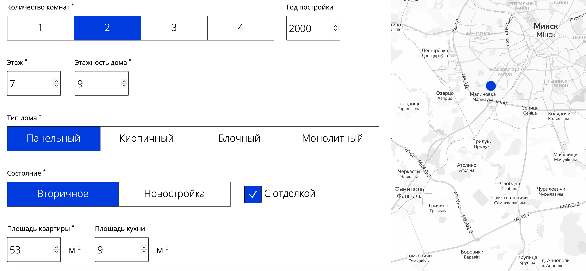

# RealtorBot.by
Apartment price prediction (Belarus, Minsk)

Tech stack:
- Flask, Docker, bs4
- NGBoost (for predicting distribution to determine uncertainty), sklearn pipeline

https://realtorbot.by

## Screenshots

